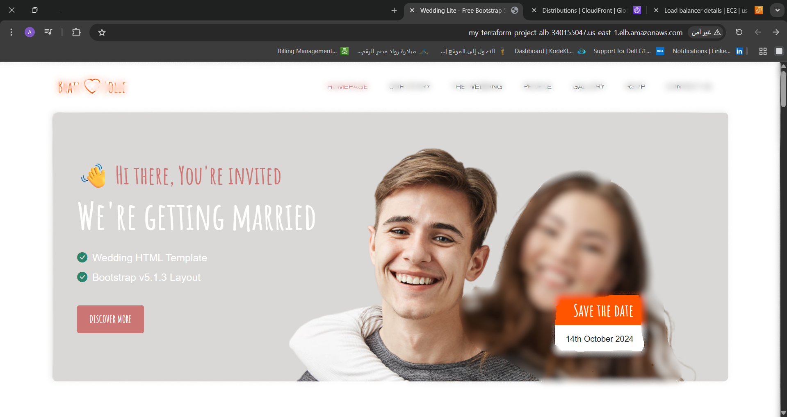

#  Wedding Website Deployment

✨ This repository demonstrates deploying a **2-tier wedding website** on AWS using **Terraform**.

---

## 🎥 Visual Demo

If you are a visual learner, you can see a demo of the live website served via AWS Load Balancer:



---

## 🔹 Architecture Overview

- **2-tier application**
  - **Web Tier:** EC2 instances running the wedding website
  - **Database Tier:** MySQL RDS instance
- **Networking**
  - Public and private subnets in a VPC
  - Application Load Balancer (ALB) routing HTTP traffic to the web tier
- **Auto Scaling**
  - Auto Scaling Group (ASG) to dynamically scale instances based on CPU utilization
- **CDN**
  - CloudFront distribution for global caching and faster delivery

**Screenshots from AWS:**

- Load Balancer List:   
- Load Balancer Details:   
- CloudFront Distribution:   
- Website Frontend: 

---

## 🗂️ Project Setup

### 1. Terraform Backend (optional)

If you want to store state in **S3 with DynamoDB locking**, add a `backend.tf`:

```hcl
terraform {
  backend "s3" {
    bucket         = "YOUR_BUCKET_NAME"
    key            = "backend/wedding_website.tfstate"
    region         = "us-east-1"
    dynamodb_table = "YOUR_DYNAMODB_TABLE_NAME"
  }
}
````

### 2. Configure Variables

Edit `terraform.tfvars` in the `root` directory with your environment values:

```hcl
region = "us-east-1"
project_name = "wedding-website"
vpc_cidr = "10.0.0.0/16"

pub_sub_1a_cidr = "10.0.1.0/24"
pub_sub_2b_cidr = "10.0.2.0/24"
pri_sub_3a_cidr = "10.0.3.0/24"
pri_sub_4b_cidr = "10.0.4.0/24"
pri_sub_5a_cidr = "10.0.5.0/24"
pri_sub_6b_cidr = "10.0.6.0/24"

db_username = "admin"
db_password = "pass"
```

### 3. Initialize and Deploy

Go to the `root` folder:

```sh
cd root
terraform init
terraform plan
terraform apply
```

Type `yes` to confirm deployment.

---

## ⚠️ Notes

* `.gitignore` is included to avoid uploading sensitive files:

```gitignore
*.tfstate
*.tfstate.backup
.terraform/
.terraform.lock.hcl
terraform.tfvars
crash.log
```

* CloudFront and RDS may have **Free Tier restrictions**, so ensure your AWS account supports the chosen instance sizes.

---

## 💡 Author

* **Abd Elrahman Mohamed Anter**
* Contact: [Linkedin](www.linkedin.com/in/abd-elrahman-mohamed-anter)


**Thank you so much for reading..😅**
